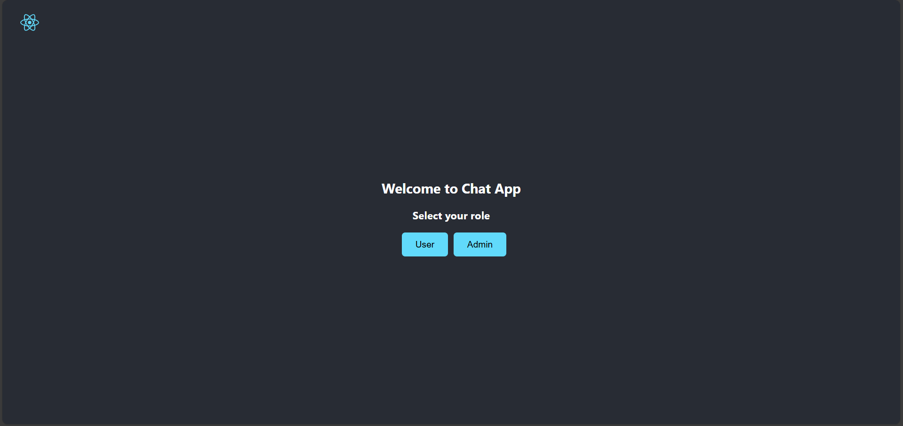
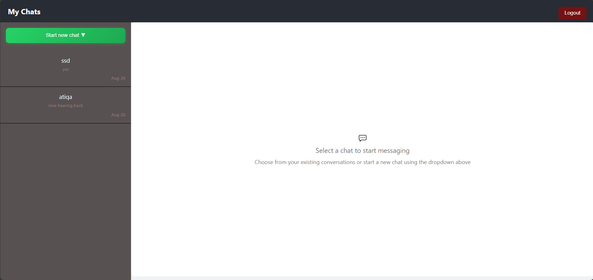
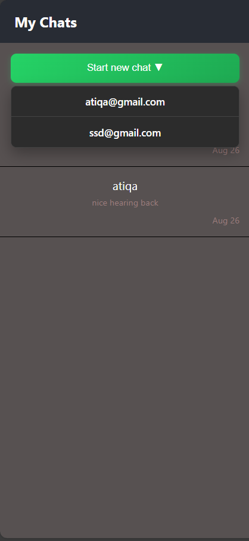
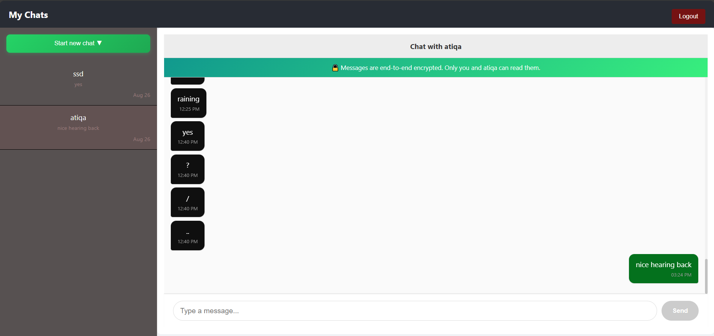

# A Chat App in Web 

This problem has
- Clear UI
- minimalist design
- send a message to anyone
- live chat
- Send a message to anyone by seeing through the dropdown 
- two panels ( both independent of each other)

## How to start it 

First, CLone the repo, then 
### `npm start`

Runs the app in development mode.\
Open [http://localhost:3000](http://localhost:3000) to view it in your browser.

The page will reload when you make changes.\
You may also see any lint errors in the console.

### For backend

Open the code in Eclipse or IntelliJ 
- clone the repo
- run the project
 Both are connected 
### Demo 

